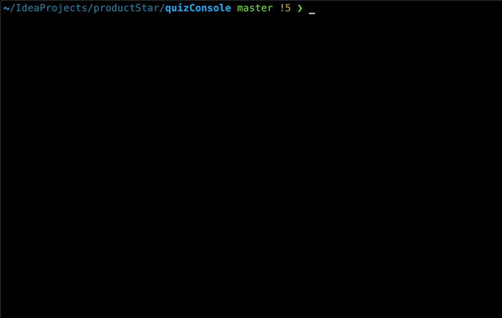

# Дипломный проект

## Описание проекта

Проект представляет собой программу для тестирования по какой-либо теме. К примеру по курсу Java :)

## Описание задачи

Необходимо написать код в классе в пакете `ru.productstar` таким образом, чтобы все тесты стали зелеными.
Проект использует некоторые технологии, которые могли быть не пройдены в течение курса (Maven, Junit). Глубокое понимание этих технологий не требуется, они используются лишь для удобства разработки. 

### Запуск проекта

1. Для сборки и запуска проекта потребуется установить систему сборки [Maven](https://maven.apache.org/download.cgi), инструкции по установке [тут](https://maven.apache.org/install.html) или [тут](https://www.baeldung.com/install-maven-on-windows-linux-mac).
Проверить установку можно командой `mvn --version`, успешный вывод примерно такой:
```
Apache Maven 3.6.3 (cecedd343002696d0abb50b32b541b8a6ba2883f)
Maven home: /usr/local/Cellar/maven/3.6.3_1/libexec
Java version: 15.0.2, vendor: N/A, runtime: /usr/local/Cellar/openjdk/15.0.2/libexec/openjdk.jdk/Contents/Home
Default locale: en_GB, platform encoding: UTF-8
OS name: "mac os x", version: "10.15.7", arch: "x86_64", family: "mac"
```
2. Запуск проекта осуществляется с помощью команды `mvn exec:java`
3. Пример работающей программы:
   

### Запуск тестов
1. Установить Maven
1. В терминале запустить `mvn test`